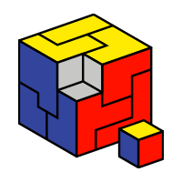

# Welcome to my profile ! 👋

My name's Dorian and I'm a CS student currently studying @ [Epita](https://www.epita.fr) in Rennes, France. 

### Hobbies and Skills 🎯
---

I love:
- Math 📚 
- AI 🧠 
- Algorithms 💻
- Robotics 🤖
- Embedded systems ✈
- Sailing ⛵
- Anything that is ocean-related 🌊

I mostly use:
- Python for prototyping, coding constest, etc...
- C/C++ for bigger projects
- OCaml for teaching freshmen basics of recursion programming (soon)

### Projects
---

1. **OCR Project**
> Language : `C`

Implementation of a multi-layer neural network including backpropagation learning algorithm, recognizing printed characters
(Private because school subject)

2. **GreenData**
> Language : `Python` | Framework : *Django*

Creation of a website similar to [OpenFoodFacts](https://openfoodfacts.org) but oriented on products' packaging

### Associations
---

Member of the French National Programming Contest [Prologin](https://prologin.org) 

Member of [Girls Can Code !](https://gcc.prologin.org), which aims to make young girls discover IT and programming

### Stats
---

