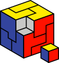

# Hi ! 👋

The name's Dorian and I'm a student at EPITA Paris, France.

### Hobbies and Skills 🎯
---

#### I love:
- Embedded systems 💻
- Sailing ⛵
- Anything that is ocean-related 🌊
- Maths  📚
- Algorithmics 💻

#### Languages

  

I like embedded, low-level and tooling stuff. If it has an LED and a datasheet, then I want to know how it works.

### Projects
---

1. **42sh**
> Language : `C`

Four weeks school project, implementing a POSIX shell in C.

2. **OCR Project**
> Language : `C`

Implementation of a multi-layer neural network including backpropagation learning algorithm, recognizing printed characters
(Private because school subject)

### Volunteering
---

Member of the French National Programming Contest [Prologin](https://prologin.org)

Member of [Girls Can Code !](https://girlscancode.fr), which aims to make young girls discover IT and programming

### Stats
---

